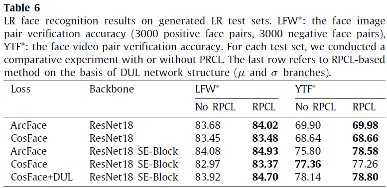

## Description

This is an implementation of ''Deep Rival Penalized Competitive Learning for low-resolution face recognition''.  
Li P, Tu S, Xu L. Deep Rival Penalized Competitive Learning for low-resolution face recognition[J]. Neural Networks, 2022.

Current face recognition tasks are usually carried out on high-quality face images, but in reality, most face images are captured under unconstrained or poor conditions, e.g., by video surveillance. Existing methods are featured by learning data uncertainty to avoid overfitting the noise, or by adding margins to the angle or cosine space of the normalized softmax loss to penalize the target logit, which enforces intra-class compactness and inter-class discrepancy. In this paper, we propose a deep Rival Penalized Competitive Learning (RPCL) for deep face recognition in low-resolution (LR) images. Inspired by the idea of the RPCL, our method further enforces regulation on the rival logit, which is defined as the largest non-target logit for an input image. Different from existing methods that only consider penalization on the target logit, our method not only strengthens the learning towards the target label, but also enforces a reverse direction, i.e., becoming de-learning, away from the rival label. Comprehensive experiments demonstrate that our method improves the existing state-of-the-art methods to be very robust for LR face recognition.

 

This is an overview of deep RPCL learning for face recognition in comparisons with existing methods. Neural network f (x|ω) map input image x to face feature z in latent space, and the classification logit β are obtained through a fully connected network. wi denotes class center. Suppose the ground truth of z is y1, and the class center of y1 is w1, then w1 is the target center of z. We compute the distance from the predictive probability. Existing method increases the distance between z and target center w1 on loss function, with z becoming z′ , and finally achieves the goal of enforcing intra-class compactness by punishing target logit. Our deep RPCL learning not only increases the distance between z and target center w1, but also takes into account the closest non-target center w3 (rival) and shortens the distance between z and w3, with z becoming z′ . Finally, z can get closer to the target center and away from potential threats. At the same time, class w3 will have less interference and establish a clearer boundary.

## Requirement
python 3.6  
pytorch 1.7.1  
scikit-image  0.16.2   
scikit-learn 0.23.2  
scipy 1.2.1   
opencv-python 4.4.0.46  
numpy 1.19.4  


## Dataset

**Training datasets.**  

We choose CASIA-WebFace as the training set, and it contains 10,575 subjects, a total of about 500,000 face images crawled from the web. For data preprocessing, we adopt [insightface](https://github.com/deepinsight/insightface) to do face detection and face alignment, and finally crop to the target size (120 × 120) as HR images.  We use cubic interpolation to down-sample HR to 16 x 16 as LR images, which then enlarged to 120×120 by a commonly-used super-resolution technology, [VDSR](https://github.com/twtygqyy/pytorch-vdsr). 

**Testing datasets.**  

(1) native unconstrained LR images. We use LR benchmark SCFace and TinyFace datasets to evaluate the LR recognition performance. The SCFace and TinyFace are two widely-used, real LR testing datasets. 

(2) [`dataset/high_low_LFW/16x16_120`, `dataset/high_low_YTF/16x16_120`] synthesized real-world LR images. To further evaluate the robustness of deep RPCL in LR face recognition, we conduct experiments on LR generations, i.e. LFW\*, YTF\*, and MegaFace\*, which are very close to the faces taken by the surveillance cameras. We use the public [code](https://github.com/yoon28/unpaired_face_sr) of a recent specialized LR face generation model to generate LR samples (16 × 16) to simulate real-world LR face images. All the 16 × 16 LR images are then enlarged to 120 × 120 by a commonly-used super-resolution technology, [VDSR](https://github.com/twtygqyy/pytorch-vdsr). 

(3) [`dataset/LFW/16x16_120`] We also notice that some existing LR methods have been evaluated on LFW using bicubic to down-sample to 16 × 16 and then up-sample to target size. To make a fair comparison, we conduct a comparison under the same setting. The results in Table 7 indicate the effectiveness of the deep RPCL to improve the LR face recognition. 


## Test

1. We provide RPCL_Magface model in Tab. 5 and Tab. 7. You can make the following settings and run the following commands.

    ```
    #### For TinyFace test in Tab. 5
    in magface_lr/tinyface/feature_mat.py
    	parser.add_argument('--ckpt_path', type=str, default=config.test_model_path, help='')
    in RPCL/config.py
    	self.test_model_path = self.BASE_DIR + 'checkpoints/rpcl_magface_tinyface_f05t07.pth' 
    $ cd magface_lr/tinyface
    $ python feature_mat.py --is_rpcl 1 --f 0.5 --thred 0.7
    # An 'rpcl_magface_tinyface_f05t07.pth_feature' folder will be generated under the 'checkpoints' folder to save the features of tinyface faces
    in magface_lr/tinyface/test_face_identification.m
    	feature_folder=abspath(checkpoints/rpcl_magface_tinyface_f05t07.pth_feature)
    # using matlab to compute Rank-K
    $ cd magface_lr/tinyface
    $ test_face_identification
    
    #### For LFW test in Tab. 7
    in RPCL/config.py
        self.test_model_path = self.BASE_DIR + 'checkpoints/rpcl_magface_sota_f05t07.pth'
        self.test_root = self.BASE_DIR + 'dataset/test_set/LFW/16x16_120'
        self.test_list = self.BASE_DIR + 'dataset/test_set/LFW/lfw_test_pair.txt'
    in magface/eval.py
    	model = SoftmaxBuilder(class_num=10575, is_rpcl=True, thred=0.7, f=0.5)
    $cd magface_lr
    $python eval.py
    ```
    
 
    
2. We provide CosFace with ResNet18 SE-block model and CosFace+DUL model in Tab. 6. You can make the following settings and run the following commands.

    *  CosFace with ResNet18 SE-block model
        ```
        #### For LFW*
        in RPCL/config.py
            self.test_model_path = self.BASE_DIR + 'checkpoints/high-low-se-cos-rpcl.pth'
            self.test_root = self.BASE_DIR + 'dataset/test_set/high_low_LFW/16x16_120'
            self.test_list = self.BASE_DIR + 'dataset/test_set/high_low_LFW/lfw_test_pair.txt'
        $ cd RPCL
        $ python eval.py
        
        #### For YTF*
        in RPCL/config.py
            self.test_model_path = self.BASE_DIR + 'checkpoints/high-low-se-cos-rpcl.pth'
            self.ytf_test_root = self.BASE_DIR + 'dataset/test_set/high_low_YTF/16x16_120'
            self.ytf_test_list = self.BASE_DIR + 'dataset/test_set/high_low_YTF/YTF_list.txt'
        $ cd RPCL
        $ python eval.py
    	```

    * CosFace+DUL model

        ```
        For LFW*
        in DUL/config.py
            self.test_model_path = self.BASE_DIR + 'checkpoints/high-low-DUL-cos-rpcl-0.01-84.70.pth'
            self.test_root = self.BASE_DIR + 'dataset/test_set/high_low_LFW/16x16_120'
            self.test_list = self.BASE_DIR + 'dataset/test_set/high_low_LFW/lfw_test_pair.txt'
            $ cd DUL
        $ python eval.py

        For YTF*
        in DUL/config.py
            self.test_model_path = self.BASE_DIR + 'checkpoints/high-low-DUL-cos-rpcl-0.01-84.70.pth'
            self.ytf_test_root = self.BASE_DIR + 'dataset/test_set/high_low_YTF/16x16_120'
            self.ytf_test_list = self.BASE_DIR + 'dataset/test_set/high_low_YTF/YTF_list.txt'
        $ cd DUL
        $ python eval.py
        ```

     

3. We provide RPCL-Cos model in Tab. 7. You can make the following settings and run the following commands.

    ```
    in RPCL/config.py
        self.test_model_path = self.BASE_DIR + 'checkpoints/RPCL-Cos_lfw_0.9513sota.pth'
        self.test_root = self.BASE_DIR + 'dataset/test_set/LFW/16x16_120'
        self.test_list = self.BASE_DIR + 'dataset/test_set/LFW/lfw_test_pair.txt'
    $ cd RPCL
    $ python eval.py
    ```

     


## Train

To train RPCL-Arc and RPCL-Cos in Table 7, run

```
### For RPCL-Arc
in RPCL/config.py
	self.resolution = 16
    self.fc_mode = 'arcface'
    self.is_rival = True
    self.train_root = self.BASE_DIR + 'dataset/training_set/casia/{}x{}_120'.format(self.resolution, self.resolution)
    self.train_list = self.BASE_DIR + 'dataset/training_set/casia/new_cleaned_list.txt'
    self.test_root = self.BASE_DIR + 'dataset/test_set/LFW/16x16_120'
    self.test_list = self.BASE_DIR + 'dataset/test_set/LFW/lfw_test_pair.txt'
$ cd RPCl
$ python main.py

### For RPCL-Cos
in RPCL/config.py
	self.resolution = 16
    self.fc_mode = 'cosface'
    self.is_rival = True
    self.train_root = self.BASE_DIR + 'dataset/training_set/casia/{}x{}_120'.format(self.resolution, self.resolution)
    self.train_list = self.BASE_DIR + 'dataset/training_set/casia/new_cleaned_list.txt'
    self.test_root = self.BASE_DIR + 'dataset/test_set/LFW/16x16_120'
    self.test_list = self.BASE_DIR + 'dataset/test_set/LFW/lfw_test_pair.txt'
$ cd RPCl
$ python main.py
```

To train RPCL-Magface in Table 7, run

```
in magface_lr/config.py
    self.resolution = 16
    self.fc_mode = 'cosface'
    self.is_rival = True
    self.train_root = self.BASE_DIR + 'dataset/training_set/casia/{}x{}_120'.format(self.resolution, self.resolution)
    self.train_list = self.BASE_DIR + 'dataset/training_set/casia/new_cleaned_list.txt'
    self.test_root = self.BASE_DIR + 'dataset/test_set/LFW/16x16_120'
    self.test_list = self.BASE_DIR + 'dataset/test_set/LFW/lfw_test_pair.txt'
$ cd magface_lr
$ python main.py --thred 0.7 --f 0.5 
```


## Citation

If you use this code, please cite it in your paper.
```
@article{LI2022183,
title = {Deep Rival Penalized Competitive Learning for low-resolution face recognition},
journal = {Neural Networks},
volume = {148},
pages = {183-193},
year = {2022},
issn = {0893-6080},
author = {Peiying Li and Shikui Tu and Lei Xu}
}
```
